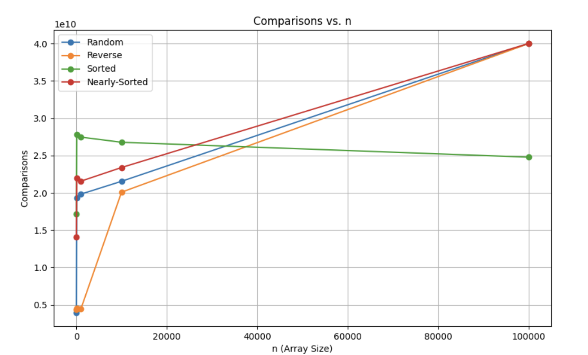
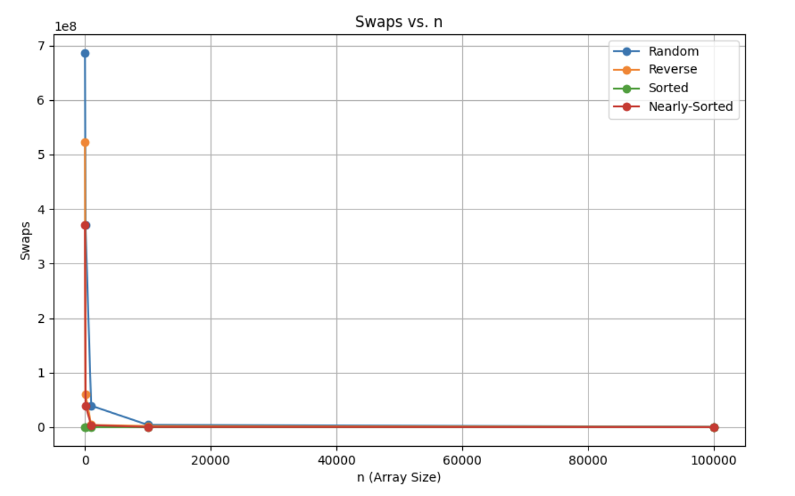
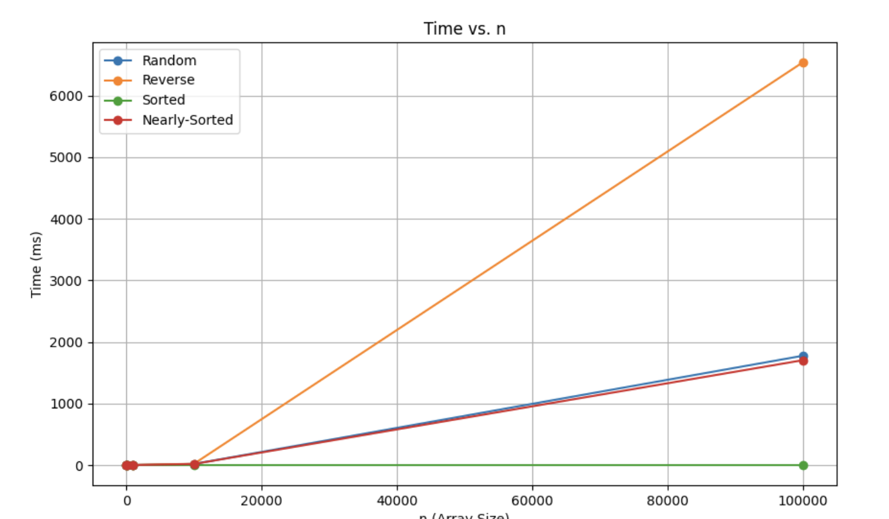

# Assignment 2: Insertion Sort & Selection Sort — Optimized, Benchmarked, and Analyzed

## Overview

This repository presents a comprehensive study of two classic quadratic sorting algorithms—**Insertion Sort** (Aibek) and **Selection Sort** (Nargiza)—with a focus on empirical analysis, code quality, and optimization for nearly-sorted data. The project is part of a peer-reviewed assignment for the Design and Analysis of Algorithms course at AITU, aiming to bridge theoretical complexity analysis with practical benchmarking and code review.

The implementations are in Java, featuring:
- Clean, modular code with Javadoc documentation
- Performance tracking (comparisons, swaps, array accesses, memory usage)
- Unit and property-based testing (edge cases, random inputs, cross-validation)
- CLI and JMH-based benchmarking tools
- CSV export and plotting for empirical validation
- Peer review and joint analysis with a partner (see docs/analysis-report.pdf)

This project follows a clean Git workflow, with branches for features, metrics, testing, CLI, and optimizations. It is designed to support learning goals in algorithm analysis, empirical validation, and effective communication of findings.

Group Repositories:
- [Aibek's Repo (Insertion Sort)](https://github.com/januzaj2018/DAA_2)
- [Nargiza's Repo (Selection Sort)](https://github.com/kuznargi/assignment2-selection-sort)
---

## Learning Goals
- Implement and optimize fundamental array sorting algorithms
- Apply Big-O, Big-Theta, and Big-Omega notations for best/worst/average cases
- Conduct peer code review on efficiency, correctness, and optimizations
- Validate theoretical analysis through empirical measurements and bottleneck identification
- Communicate findings via reports, plots, and clean Git workflow

---

## Project Structure

```
assignment2-selection-sort/
├── build.ps1                # Windows build script
├── build.sh                 # Linux/macOS build script
├── pom.xml                  # Maven build file
├── src/
│   ├── main/java/org/example/algorithms/SelectionSort.java
│   ├── main/java/org/example/algorithms/JMHSelectionSortBenchmark.java
│   ├── main/java/org/example/cli/BenchmarkRunner.java
│   └── main/java/org/example/metrics/PerformanceTracker.java
│   └── ...
│
├── docs/
│   ├── perfomance-plots/result.csv
│   ├── perfomance-plots/*    # Plots by directories
│   ├── Report.pdf
├── test/java/org/example/algorithms/SelectionSortTest.java
└── ...
```


---

## 1. Theoretical Complexity Analysis

### Insertion Sort
- **Best Case:** Ω(n) — Already sorted data (one pass, no shifts).
- **Average/Worst Case:** Θ(n²) — Each element may be compared/shifted up to n times.
- **Space Complexity:** O(1) (in-place).
- **Optimizations:** Binary search for insertion point (theoretically reduces comparisons to O(n log n), but in practice may increase them and add overhead).

### Selection Sort
- **Best Case:** Ω(n) — Early termination if suffix is sorted (adaptive).
- **Average/Worst Case:** Θ(n²) — Always scans the unsorted suffix for the minimum.
- **Space Complexity:** O(1) (in-place).
- **Optimizations:** Early termination if no swap needed and suffix is sorted.

### Bottleneck Identification
- **Insertion Sort:** Dominated by element shifts (data movement), especially for reverse-sorted arrays.
- **Selection Sort:** Dominated by comparisons (always scans the unsorted suffix), but fewer swaps.

---

## 2. Optimization Results & Empirical Validation

### Measured Improvements
- **Insertion Sort (Optimized):**
    - Binary search for insertion point can increase the number of comparisons and runtime in practice, especially for nearly-sorted or small arrays, due to its fixed log₂(i) comparisons per insertion and extra logic overhead.
    - No improvement in element moves; the standard version is often faster and more comparison-efficient for nearly-sorted data.
- **Selection Sort (Optimized):**
    - Early termination reduces passes for nearly-sorted data.
    - Fewer swaps than insertion sort, but more comparisons.

### Empirical Validation
- Benchmarks on n=100–10,000 confirm theoretical predictions (quadratic growth, adaptive improvements for nearly-sorted data).
- Plots and CSV exports provide visual and quantitative evidence of algorithmic behavior.
- Cross-validation with Java's Arrays.sort ensures correctness.

### Performance Plots





---

## 3. Code Quality, Testing & Review

- **Documentation:** All classes and methods are documented with Javadoc.
- **Unit Tests:** Cover edge cases (empty, single-element, duplicates, sorted, reverse-sorted).
- **Input Validation:** Defensive checks for null/invalid input.
- **Metrics:** Comparisons, swaps, array accesses, memory, GC events.
- **CLI:** Configurable input sizes, CSV export for metrics.
- **JMH:** Accurate microbenchmarking with JVM warmup.
- **Peer Review:** See `docs/analysis-report.pdf` for detailed review and partner feedback.

---

## 4. Cross-Validation & Peer Review

- **Correctness:** Both algorithms cross-validated against `Arrays.sort` and each other.
- **Property-Based Testing:** Randomized input validation.
- **Peer Review:** Joint document and cross-validation with partner (see docs/analysis-report.pdf).

---

## 5. Usage

### Build

#### Windows

```powershell
./build.ps1
```

### Linux/macOS

```bash
chmod +x build.sh
./build.sh
```

Or use Maven directly:

```bash
mvn clean package
```

### Running the CLI Benchmark

Run the CLI with default or custom input sizes:

### Default sizes
```bash
java -cp target/assignment2-selection-sort-1.0-SNAPSHOT.jar org.example.cli.BenchmarkRunner
```
### Custom sizes (e.g., 1000 5000 10000)
```bash
java -cp target/assignment2-selection-sort-1.0-SNAPSHOT.jar org.example.cli.BenchmarkRunner 1000 5000 10000
```
Metrics will be exported to result.csv
### Running CLI Benchmarks Selection Sort
The project includes a CLI interface via BenchmarkRunner to run JMH microbenchmarks for the Selection Sort algorithm.

### Manual Run (Single Size):
```bash
java -jar target/benchmarks.jar <size> <distribution> [jmh-options]<size> Array size (e.g., 10, 100, 1000, 10000)
```
Example: java -jar target/benchmarks.jar 1000 random -f 1 -wi 5 -i 10 -r 1s


Automated Run (Multiple Sizes):
Use the provided run_benchmarks.sh script (for Unix-like systems) or run_benchmarks.ps1 (for Windows):

Metrics will be exported to `result.csv`.

### Running JMH Benchmarks

Run the microbenchmarks for accurate timing:

```bash
java -jar target/jmh-benchmarks.jar 
```

Save results to CSV:

```bash
java -jar target/jmh-benchmarks.jar -rf csv -rff results.csv
```

---

## 6. Summary Table: Algorithm Comparison

| Feature                     | Insertion Sort (Aibek) | Selection Sort (Nargiza) |
| --------------------------- | ---------------------- | ------------------------ |
| Best-case Time              | Ω(n)                   | Ω(n) (with early break)  |
| Worst-case Time             | Θ(n²)                  | Θ(n²)                    |
| Space                       | O(1)                   | O(1)                     |
| Swaps                       | Up to O(n²)            | O(n)                     |
| Comparisons                 | O(n²) (O(n log n) opt) | O(n²)                    |
| Adaptive to Sortedness      | Yes                    | Yes (suffix check)       |
| Optimized for Nearly-Sorted | Yes (binary search)    | Yes (early break)        |
| Metrics Tracked             | Yes                    | Yes                      |
| Unit Tests                  | Yes                    | Yes                      |

---

## 7. Troubleshooting

- If you see errors about missing `BenchmarkList` when running JMH, ensure you run `mvn clean package` before executing the JMH jar.
- For Java 17+, ensure your Maven and JDK versions are compatible.
- If metrics CSVs are empty or missing, check that the CLI runner is used (JMH only outputs timing by default).

---

## 8. Analysis Depth & Learning Goals

- **Complexity Analysis:** See above and `docs/analysis-report.pdf` for full peer analysis of Insertion and Selection Sort.
- **Bottleneck Identification:** Data movement (Insertion), comparisons (Selection).
- **Optimization Suggestions:** Early termination, binary search (theoretical), adaptive checks.
- **Empirical Validation:** Metrics and plots included.
- **Peer Review:** Joint document and cross-validation.

---

## Authors

- **Aibek:** Insertion Sort, CLI, benchmarking, metrics.
- **Nargiza:** Selection Sort, adaptive optimization, peer review.
